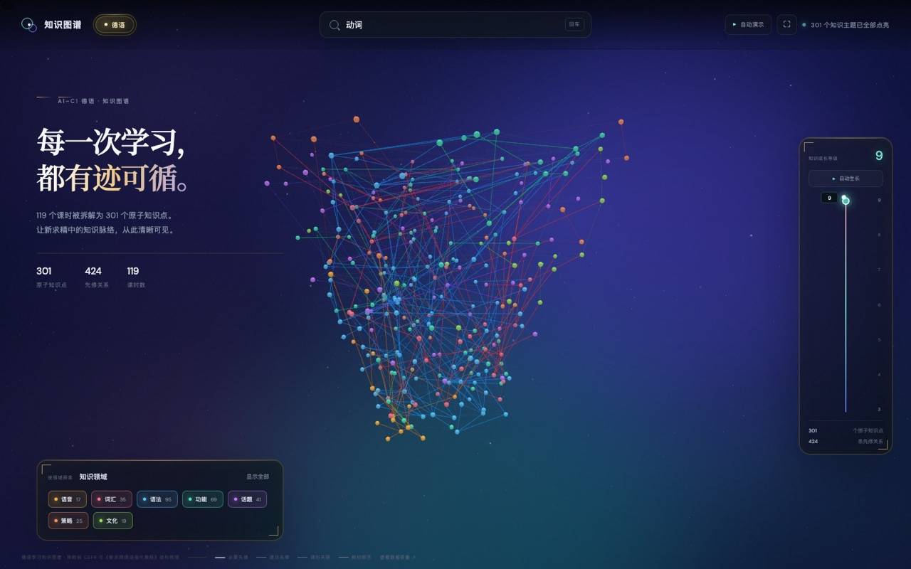

# 德语知识图谱

基于 Three.js + 3d-force-graph 的 3D 力导向知识图谱，把《新求精德语强化教程》的教材结构拆成**原子知识点**，用有向图呈现「先修 → 解锁」的学习路径。覆盖 **A1.1 – C1.2** 共 10 个等级档。




## 功能特性

- **三维力导向图谱**：301 个知识点节点按先修关系自动布局，节点颜色区分 7 个知识领域
- **搜索定位**：顶部搜索框输入知识点名称，候选下拉实时联想，选中后镜头自动聚焦并高亮该节点
- **先修 / 解锁双向追溯**：右侧详情面板列出「直接先修」「可解锁主题」「掌握证据」「所属课时」
- **等级轴过滤**：底部 A1.1 → C1.2 十档滑块，拖动即按欧标等级裁剪图谱范围
- **自动生长动画**：一键播放知识体系随等级逐步点亮的成长过程
- **自动演示**：沿重点知识链路播放动画，逐步展示学习路径
- **领域筛选**：7 个知识领域（语音 / 语法 / 词汇 / 功能 / 话题 / 策略 / 文化）自由开关
- **关系图例**：必要先修、建议先修、课时关联、教材顺序四类边线分色显示

## 数据规模

| 指标 | 数量 |
| --- | --- |
| 原子知识点 | 301 |
| 先修关系 | 424（必要先修 335 + 建议进阶 89） |
| 课时记录（Lektion 节） | 119 |
| 教材顺序边 | 118 |
| 高阶概念组 | 212 |

**按等级档分布（10 档）**

| A1.1 | A1.2 | A2.1 | A2.2 | B1.1 | B1.2 | B2.1 | B2.2 | C1.1 | C1.2 |
| --- | --- | --- | --- | --- | --- | --- | --- | --- | --- |
| 36 | 63 | 41 | 34 | 29 | 29 | 19 | 18 | 15 | 17 |

**按知识领域分布（7 个）**

| 语音 | 语法 | 词汇 | 功能 | 话题 | 策略 | 文化 |
| --- | --- | --- | --- | --- | --- | --- | --- |
| 17 | 95 | 35 | 69 | 41 | 25 | 19 |

**知识点类型分布（5 类）**

| REPRESENTATIONAL | CONCEPTUAL | PROCEDURAL | LANGUAGE | META |
| --- | --- | --- | --- | --- |
| 17 | 65 | 158 | 36 | 25 |

## 数据来源

教材结构来自《新求精德语强化教程》五册：

| 教材分册 | 对应阶段 | 课时记录数 |
| --- | --- | --- |
| 新求精初级 I | A1 阶段 | 28 |
| 新求精初级 II | A2 阶段 | 28 |
| 新求精中级 I | B1 阶段 | 24 |
| 新求精中级 II | B2 阶段 | 19 |
| 新求精高级教程 | C1 阶段 | 20 |

知识点水平对齐欧标 CEFR。图谱结构已通过完整性校验：单连通分量、无环、无孤立点、无自环、无重边；根节点 54 个，叶节点 107 个。质量报告见 [`data/quality-report-german.json`](data/quality-report-german.json)。

## 快速开始

```bash
# 本地预览（任选其一）
node serve.cjs                      # http://localhost:3211
python3 -m http.server 3211         # 然后访问 http://localhost:3211
```

也可以直接双击 `index.html`，但部分浏览器对 `file://` 下的本地脚本加载有限制，建议用上面的方式起一个本地服务。

渲染依赖通过 CDN 加载（three@0.160.0 + 3d-force-graph@1.73.3），无需 `npm install`。首次打开需联网。

## 项目结构

```
.
├── index.html                    # 页面骨架（开场页 / 搜索 / 等级轴 / 详情面板）
├── app.js                        # 可视化主程序（渲染、交互、搜索、演示、动画）
├── styles.css                    # 深空 + 学院金主题样式
├── taxonomy-data-german.js       # 德语知识图谱数据（301 知识点 / 424 先修关系）
├── serve.cjs                     # 本地静态服务器
├── 使用说明.txt                   # 面向使用者的简要说明
├── assets/
│   ├── planet-core.png           # 开场页星球纹理
│   └── graph-overview.jpg        # README 预览图
└── data/
    ├── quality-report-german.json  # 德语数据质量报告
    ├── en-topics.json              # 英语知识点（历史数据）
    ├── en-deps.json                # 英语先修关系（历史数据）
    └── quality-report.json         # 英语数据质量报告（历史数据）
```

## 数据结构

`taxonomy-data-german.js` 挂载全局变量 `MARBLE_DATA_GERMAN`，包含 8 个顶层字段：

| 字段 | 说明 |
| --- | --- |
| `topics` | 301 个原子知识点（id / 类型 / 领域 / 名称 / 描述 / 掌握证据 / 评估提示 / 欧标依据 / 中心度） |
| `dependencies` | 424 条先修关系，`strength` 为 `hard`（概念级必要先修）或 `soft`（同概念跨课时进阶） |
| `lessonRecords` | 119 条课时记录，负责教材位置与顺序 |
| `topicMetadata` | 知识点到课时、教材章节的归属与拆分方式 |
| `lessonTopicLinks` | 课时与知识点的归属关系，用于同课时内连线 |
| `curriculumSequence` | 118 条教材课时编排顺序边（不是知识先修关系） |
| `concepts` | 212 个高阶概念组，把同一概念下的知识点聚簇 |
| `quality` | 数据质量统计与图谱健康度 |

## License

MIT
